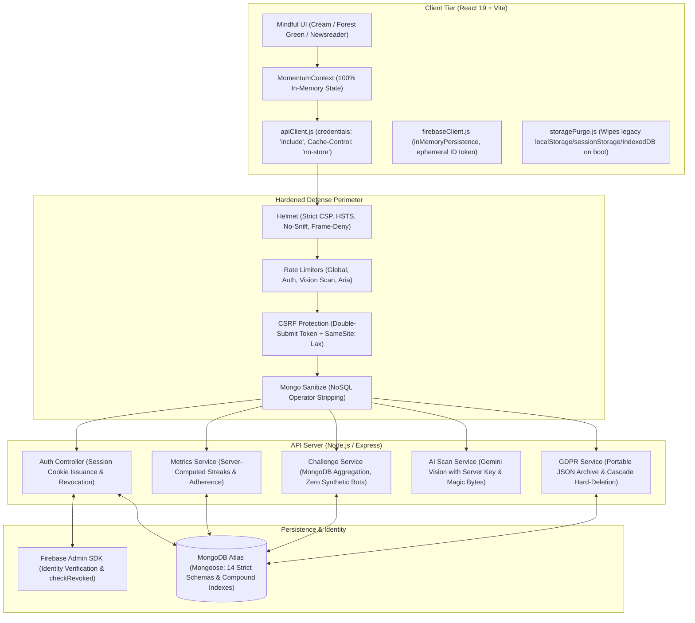

# Momentum — Mindful Habit Sanctuary & Daily Rhythm Platform

[](https://github.com/momentum-mindful-habits/momentum/actions/workflows/ci.yml)
[](https://nodejs.org/)
[](https://opensource.org/licenses/MIT)

Momentum is a production-grade full-stack mindful habit tracker, rhythm sanctuary, and wellness companion. Built with a React 19 + Framer Motion frontend, a hardened Node.js/Express API, MongoDB Atlas as the single source of truth, and Firebase Google Sign-In with server-issued httpOnly session cookies.

---

## 🏛️ System Architecture



---

## 🔒 Security & Privacy Highlights

- **Zero Client-Side Storage:** Strictly zero user data in `localStorage`, `sessionStorage`, `IndexedDB`, or JS-readable cookies. All data lives in-memory while active and persists solely in MongoDB Atlas. Verified via `npm test` AST scan and runtime DevTools inspection.
- **Server-Issued Session Cookies:** Firebase ID tokens are ephemeral and exchanged immediately via `POST /api/auth/session` for a cryptographic `httpOnly`, `Secure`, `SameSite=Lax` cookie with `checkRevoked: true`.
- **Never Trust Client Metrics:** Adherence rates (excluding rest/skipped days from denominator: `completed / (total - skipped)`), streaks, practice scores, and weekly challenge rankings are computed strictly server-side from raw log documents.
- **Strict Input Validation & Sanitization:** All payload inputs validated with strict Zod schemas rejecting unknown fields; `express-mongo-sanitize` prevents NoSQL injection attacks.
- **GDPR Ready:** Full data portability (`GET /api/profile/export`) and irreversible account cascade deletion (`DELETE /api/profile/account`) across all 14 database collections.

---

## 📂 Codebase Directory Layout

```
├── .github/workflows/ci.yml    # Automated CI (lint, tests, audit, build)
├── docker-compose.yml          # Multi-container orchestration (API + MongoDB)
├── docs/                       # Architectural documentation & migration inventory
│   └── PHASE_0_INVENTORY.md    # Legacy keys and API mapping
├── server/                     # Backend Node/Express API Server
│   ├── Dockerfile              # Multi-stage hardened alpine container
│   ├── app.js                  # Express middleware pipeline assembly
│   ├── server.js               # HTTP server entrypoint & graceful shutdown
│   ├── scripts/                # Database maintenance (seed, createIndexes)
│   ├── src/
│   │   ├── config/             # Environment, Database, Firebase, Score weights
│   │   ├── controllers/        # Route handlers for all 12 feature domains
│   │   ├── middleware/         # Security headers, auth, rate limiting, csrf, errors
│   │   ├── models/             # 14 Mongoose models with strict schemas
│   │   ├── routes/             # RESTful API route declarations
│   │   ├── services/           # Metrics, Challenge aggregation, AI Vision, Export
│   │   └── utils/              # Pino logger, magic-byte validator
│   └── tests/                  # Node native test suites (security, metrics, deletion)
├── src/                        # Frontend React 19 Application
│   ├── components/             # Reusable UI widgets, modals, layout, soundscapes
│   ├── context/                # In-memory AuthContext and MomentumContext
│   ├── pages/                  # Route views (Today, To-Dos, Voice, Rituals, Focus, etc.)
│   ├── services/               # apiClient.js, firebaseClient.js, storagePurge.js
│   ├── motionConfig.js         # Apple/Awwwards-grade motion curves and springs
│   ├── App.jsx                 # View router and layout shell
│   └── main.jsx                # Application bootstrapper with storage purge
├── tests/                      # Frontend unit & storage leak audit tests
├── SECURITY_REPORT.md          # Threat model & vulnerability scan findings
├── UI_AUDIT.md                 # Accessibility & motion design evaluation
└── LAUNCH_CHECKLIST.md         # Production deployment runbook
```

---

## 🚀 Quick Start

### 1. Prerequisites
- **Node.js**: v18.0.0 or higher
- **MongoDB**: Local MongoDB instance or MongoDB Atlas cluster URI
- **Firebase Project**: Google Sign-In enabled with Web App credentials and Admin Service Account key

### 2. Environment Setup
Copy the environment template files and provide your secrets:
```bash
# Frontend environment
cp .env.example .env

# Backend server environment
cp server/.env.example server/.env
```

### 3. Install Dependencies
```bash
# Install frontend dependencies
npm install

# Install server dependencies
cd server && npm install && cd ..
```

### 4. Running the Development Environment
Run backend API server:
```bash
cd server
npm run dev
# Starts on http://localhost:5000
```

In a separate terminal, run the Vite frontend:
```bash
npm run dev
# Starts on http://localhost:3000
```

### 5. Running with Docker Compose
```bash
docker-compose up --build
```

---

## 🧪 Testing & Verification

```bash
# 1. Run client unit tests & storage leak verification (AST check)
npm test

# 2. Run server API, security, and timezone calculation tests
cd server && npm test

# 3. Security audits (Zero vulnerabilities)
npm audit
cd server && npm audit

# 4. Production build
npm run build
```

---

## 📑 Documentation Index

- [Security & Threat Model Audit](SECURITY_REPORT.md)
- [UI/UX & Accessibility Audit](UI_AUDIT.md)
- [Production Launch Checklist](LAUNCH_CHECKLIST.md)
- [Phase 0 Migration Inventory](docs/PHASE_0_INVENTORY.md)

---

## 📄 License
MIT License. Designed with mindful care.
