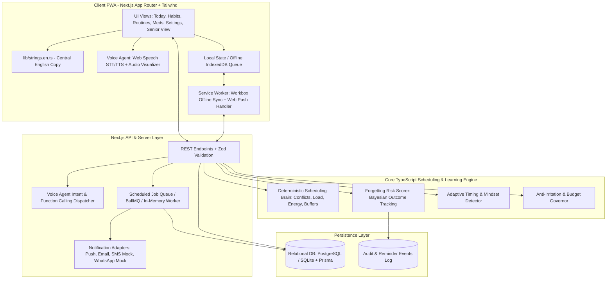

# NeverForget: Smart, Calm Daily-Life Assistant (Web/PWA + Voice Agent)
## Comprehensive Architecture, Database Schema, Task List & Implementation Plan

> **Product**: NeverForget — Smart, Calm Daily-Life Assistant  
> **Target Audience**: Everyone from 13-year-old teens (Riya) to 35-year-old professionals (Arjun) and 75-year-old seniors (Grandpa).  
> **Core Loop**: *Know the person $\rightarrow$ Suggest what they may forget $\rightarrow$ Remind at the right moment $\rightarrow$ Learn from what happened.*  
> **Language Rule**: English Only (`/lib/strings.en.ts`), plain simple English, Indian/US/UK English accent tolerance.

---

## 1. Executive Summary & Design Philosophy

**NeverForget** is an installable PWA and Voice Agent that serves as an unhurried, respectful daily-life assistant. It prevents forgetting and manages busy multi-task days without ever nagging, judging, or overwhelming the user.

### Key Architectural Invariants
1. **Calm Technology & Zero-Guilt Language**: The busier the user, the quieter the app. Missed tasks are marked "Not yet" or offered gentle rescheduling. No guilt streaks, no alarming red badges.
2. **"Default + Custom Everywhere"**: Every feature operates out of the box with intelligent, role-tailored defaults while progressive disclosure allows custom fine-tuning with 1-click "Reset to Default".
3. **Guest-First, Zero-Friction Utility**: Immediate utility in under 60 seconds without mandatory registration. Data seamlessly transitions when linking Google or Phone OTP.
4. **Deterministic Scheduling Brain + Pluggable AI Voice Agent**: Core reminders and conflict resolutions are computed by a deterministic, pure TypeScript rule engine with mathematical guarantees. The Voice Agent utilizes browser Web Speech (STT/TTS) and structured LLM function calling with strict server-side validation.
5. **English-Only Centralization**: Single source of truth for all copy in `lib/strings.en.ts` with plain, accessible vocabulary suitable for ages 12 to 80+.

---

## 2. Architecture Overview



### Component Breakdown
1. **Frontend Layer (Next.js 14+ / React / Tailwind CSS / PWA)**:
   - Mobile-first, fully responsive (tested at 375px mobile, 768px tablet, 1280px+ desktop).
   - High-contrast, Senior Mode (massive touch targets, 3-action limit: Done / Later / Skip), and adjustable typography scale (100% to 200%).
   - Service Worker providing full offline read/write with an offline mutation queue and Web Push notifications.
2. **Centralized English Copy Module (`lib/strings.en.ts`)**:
   - Organized by feature domain (`onboarding`, `tasks`, `scheduling`, `voice`, `medicine`, `routines`, `insights`, `settings`, `errors`).
   - Every string written in grade-6 reading level plain English.
3. **Deterministic Scheduling Brain (`lib/brain/scheduler.ts`)**:
   - Pure, idempotent TypeScript engine.
   - Algorithmic stages:
     1. Place Fixed items (time locks).
     2. Place Anchored items (around meals/wake/sleep windows).
     3. Insert dynamic travel & recovery buffer times (e.g. rest block after workout).
     4. Slot Flexible items matching task difficulty to user energy curve.
     5. Conflict detection with automated 1-tap resolution options.
     6. "Minimum Viable Day" reducer (collapses day to top 3 vital tasks with 1 tap).
4. **Learning & Risk Engine (`lib/brain/learning.ts`)**:
   - Tracks granular reminder outcomes (`DONE_ON_TIME`, `DONE_LATE`, `SNOOZED`, `SKIPPED`, `IGNORED`).
   - Computes task forgetting risk scores. High risk $\rightarrow$ earlier, clearer prompt (never spam).
   - Adaptive reminder shift suggestions with transparent "Why did I get this?" explanations.
5. **Smart Voice Agent (`lib/voice/`)**:
   - Browser Web Speech API for zero-cost, privacy-first local STT & TTS.
   - Multi-accent English speech tolerance (`en-IN` Indian English default, `en-US`, `en-GB`).
   - Typed schema function calling supporting multi-intent commands, natural relative times ("in 20 mins", "after lunch"), and strict confirmation policies (instant execution + 10s undo for low-risk; 1-step yes/no confirmation for deletions and medicine changes).
6. **Multi-Channel Notification Dispatcher (`lib/notifications/`)**:
   - Unified interface `NotificationAdapter` with concrete implementations:
     - `WebPushAdapter`: Native browser push via VAPID.
     - `InAppToastAdapter`: Non-intrusive sound and banner with Undo action.
     - `EmailAdapter`: Clean digest / urgent email alert.
     - `SmsAdapter`: Standardized SMS adapter (with console/mock logger for local dev).
     - `WhatsAppAdapter`: Template-validated WhatsApp adapter (with mock preview).
   - Enforces daily notification budget (Senior: 8, Adult: 6, Teen: 8) and Quiet Hours, with Critical escalation override.

---

## 3. Database Schema

The database model is defined using Prisma ORM with strict typing, relational constraints, foreign keys, and performant indexes.

```prisma
datasource db {
  provider = "sqlite" // Easily configured to "postgresql" via DATABASE_URL
  url      = env("DATABASE_URL")
}

generator client {
  provider = "prisma-client-js"
}

// --------------------------------------------------------
// 1. User & Profile Models
// --------------------------------------------------------

model User {
  id            String          @id @default(uuid())
  email         String?         @unique
  phoneNumber   String?         @unique
  isGuest       Boolean         @default(true)
  createdAt     DateTime        @default(now())
  updatedAt     DateTime        @updatedAt

  profile       Profile?
  tasks         Task[]
  routines      Routine[]
  habits        Habit[]
  medicines     Medicine[]
  lists         CustomList[]
  reminders     Reminder[]
  reminderEvents ReminderEvent[]
  voiceCommands VoiceCommand[]
  familyOwner   FamilyLink[]    @relation("FamilyOwner")
  familyMember  FamilyLink[]    @relation("FamilyMember")
  insights      Insight[]
  auditLogs     AuditLog[]
  settings      Setting[]
}

model Profile {
  id                  String   @id @default(uuid())
  userId              String   @unique
  user                User     @relation(fields: [userId], references: [id], onDelete: Cascade)
  
  // Personas & Modes
  roleMode            String   @default("ADULT") // TEEN, YOUNG_ADULT, ADULT, MIDLIFE, SENIOR, STUDENT, HOMEMAKER
  mindsetMode         String   @default("PLANNER") // PLANNER, LAST_MINUTE, OVERWHELMED, TECH_SHY, MOTIVATION_DRIVEN, GENTLE
  tone                String   @default("FRIENDLY") // FRIENDLY, NEUTRAL, FIRM, FUNNY, RESPECTFUL_CALM
  
  // Daily Anchors & Timezone
  timezone            String   @default("UTC")
  wakeTime            String   @default("07:00") // HH:mm
  leaveHomeTime       String?  @default("08:30")
  arriveHomeTime      String?  @default("18:00")
  sleepTime           String   @default("22:30")
  
  // Voice Preferences
  voiceAccent         String   @default("en-IN") // en-IN, en-US, en-GB
  voiceSpeed          Float    @default(1.0)
  voiceEnabled        Boolean  @default(true)
  
  // Anti-Irritation Budget & Quiet Hours
  dailyNotificationBudget Int   @default(6)
  quietHoursStart     String   @default("22:00")
  quietHoursEnd       String   @default("07:00")
  pauseUntil          DateTime?
  
  // Accessibility & UI
  fontSizeScale       Int      @default(100) // 100% to 200%
  highContrast        Boolean  @default(false)
  seniorMode          Boolean  @default(false)
  learningEnabled     Boolean  @default(true)
  
  createdAt           DateTime @default(now())
  updatedAt           DateTime @updatedAt
}

// --------------------------------------------------------
// 2. Task & Scheduling Models
// --------------------------------------------------------

model Task {
  id              String         @id @default(uuid())
  userId          String
  user            User           @relation(fields: [userId], references: [id], onDelete: Cascade)
  
  title           String
  notes           String?
  category        String         @default("GENERAL") // MORNING, COMMUTE, WORK_STUDY, HEALTH, MONEY, HOME, RELATIONSHIPS, MIND, NIGHT
  taskType        String         @default("FLEXIBLE") // FIXED, ANCHORED, FLEXIBLE, GOAL_BASED, DEADLINE, ROUTINE
  priority        String         @default("IMPORTANT") // CRITICAL, IMPORTANT, NICE_TO_HAVE
  
  // Scheduling & Timing
  scheduledDate   String?        // YYYY-MM-DD
  scheduledTime   String?        // HH:mm
  durationMinutes Int            @default(15)
  energyLevel     String         @default("MEDIUM") // LOW, MEDIUM, HIGH
  
  // Recurrence & Anchors
  repeatRule      String?        // NONE, DAILY, WEEKLY, MONTHLY, CUSTOM, AFTER_HABIT
  anchorReference String?        // WAKE, LEAVE_HOME, LUNCH, ARRIVE_HOME, SLEEP, or habitId
  
  // Status & Progress
  status          String         @default("PENDING") // PENDING, IN_PROGRESS, COMPLETED, SNOOZED, SKIPPED, CANCELLED
  completedAt     DateTime?
  isMinimumViable Boolean        @default(false) // Filter for Minimum Viable Day
  
  // Relationships
  reminders       Reminder[]
  reminderEvents  ReminderEvent[]
  subtasks        Subtask[]
  
  createdAt       DateTime       @default(now())
  updatedAt       DateTime       @updatedAt

  @@index([userId, scheduledDate])
  @@index([userId, status])
}

model Subtask {
  id          String   @id @default(uuid())
  taskId      String
  task        Task     @relation(fields: [taskId], references: [id], onDelete: Cascade)
  title       String
  isCompleted Boolean  @default(false)
  order       Int      @default(0)
}

// --------------------------------------------------------
// 3. Routines, Habits & Habit Stacks
// --------------------------------------------------------

model Routine {
  id          String        @id @default(uuid())
  userId      String
  user        User          @relation(fields: [userId], references: [id], onDelete: Cascade)
  name        String        // Morning Routine, Leaving Home, Bedtime
  triggerType String        @default("TIME") // TIME, LOCATION_LEAVING, LOCATION_ARRIVING, MANUAL
  scheduledTime String?     // HH:mm
  isActive    Boolean       @default(true)
  items       RoutineItem[]
  
  createdAt   DateTime      @default(now())
  updatedAt   DateTime      @updatedAt
}

model RoutineItem {
  id          String   @id @default(uuid())
  routineId   String
  routine     Routine  @relation(fields: [routineId], references: [id], onDelete: Cascade)
  title       String   // e.g. "Check wallet & keys", "Turn off geyser/gas"
  order       Int      @default(0)
  isCompleted Boolean  @default(false)
}

model Habit {
  id              String      @id @default(uuid())
  userId          String
  user            User        @relation(fields: [userId], references: [id], onDelete: Cascade)
  title           String      // e.g. "Drink 500ml water"
  frequency       String      @default("DAILY") // DAILY, WEEKDAYS, WEEKENDS, WEEKLY_TARGET
  targetCount     Int         @default(1)
  
  // Habit Stacking
  anchorHabitId   String?     // Stack: "After [Anchor Habit], do [This Habit]"
  
  // Streaks & Grace System
  streakEnabled   Boolean     @default(true)
  currentStreak   Int         @default(0)
  bestStreak      Int         @default(0)
  streakFreezes   Int         @default(2) // Grace days to prevent demotivation
  lastCompletedOn String?     // YYYY-MM-DD
  
  createdAt       DateTime    @default(now())
  updatedAt       DateTime    @updatedAt
}

// --------------------------------------------------------
// 4. Medicine Module (Safety-Critical)
// --------------------------------------------------------

model Medicine {
  id              String         @id @default(uuid())
  userId          String
  user            User           @relation(fields: [userId], references: [id], onDelete: Cascade)
  
  name            String         // Medicine Name
  dosageText      String         // e.g. "1 tablet (500mg)"
  timingRule      String         @default("AFTER_MEAL") // BEFORE_MEAL, AFTER_MEAL, WITH_MEAL, SPECIFIC_TIME
  specificTime    String?        // HH:mm
  
  // Refill Tracking
  currentSupply   Int            @default(30)
  pillsPerDose    Int            @default(1)
  refillReminderDays Int         @default(3)
  refillAlertSent Boolean        @default(false)
  
  // Escalation & Caregiver Alert
  caregiverAlert  Boolean        @default(false)
  
  createdAt       DateTime       @default(now())
  updatedAt       DateTime       @updatedAt
}

// --------------------------------------------------------
// 5. Reminders, Escalation & Learning Event Logs
// --------------------------------------------------------

model Reminder {
  id              String         @id @default(uuid())
  userId          String
  user            User           @relation(fields: [userId], references: [id], onDelete: Cascade)
  taskId          String?
  task            Task?          @relation(fields: [taskId], references: [id], onDelete: Cascade)
  
  title           String
  remindAt        DateTime
  channels        String         @default("IN_APP,PUSH") // IN_APP, PUSH, EMAIL, SMS, WHATSAPP, VOICE
  escalationLevel Int            @default(1) // 1: Gentle, 2: Stronger, 3: SMS/Call Backup, 4: Caregiver
  isCritical      Boolean        @default(false)
  
  status          String         @default("SCHEDULED") // SCHEDULED, DELIVERED, SNOOZED, DISMISSED, CANCELLED
  snoozeCount     Int            @default(0)
  lastSnoozedAt   DateTime?
  
  events          ReminderEvent[]
  createdAt       DateTime       @default(now())
  updatedAt       DateTime       @updatedAt

  @@index([remindAt, status])
}

model ReminderEvent {
  id              String    @id @default(uuid())
  userId          String
  user            User      @relation(fields: [userId], references: [id], onDelete: Cascade)
  reminderId      String?
  reminder        Reminder? @relation(fields: [reminderId], references: [id], onDelete: SetNull)
  taskId          String?
  task            Task?     @relation(fields: [taskId], references: [id], onDelete: SetNull)
  
  outcome         String    // DONE_ON_TIME, DONE_LATE, SNOOZED, SKIPPED, IGNORED
  responseTimeSec Int?
  scheduledHour   Int       // 0-23 for risk & adaptive learning
  dayOfWeek       Int       // 0-6
  
  createdAt       DateTime  @default(now())

  @@index([userId, outcome])
  @@index([scheduledHour, dayOfWeek])
}

// --------------------------------------------------------
// 6. Lists, Family/Caregiver, Voice & Settings
// --------------------------------------------------------

model CustomList {
  id        String     @id @default(uuid())
  userId    String
  user      User       @relation(fields: [userId], references: [id], onDelete: Cascade)
  title     String     // e.g. "Groceries", "Weekend Packing"
  items     ListItem[]
  createdAt DateTime   @default(now())
  updatedAt DateTime   @updatedAt
}

model ListItem {
  id          String     @id @default(uuid())
  listId      String
  list        CustomList @relation(fields: [listId], references: [id], onDelete: Cascade)
  content     String
  isCompleted Boolean    @default(false)
  createdAt   DateTime   @default(now())
}

model FamilyLink {
  id            String   @id @default(uuid())
  ownerId       String
  owner         User     @relation("FamilyOwner", fields: [ownerId], references: [id], onDelete: Cascade)
  memberId      String
  member        User     @relation("FamilyMember", fields: [memberId], references: [id], onDelete: Cascade)
  
  relationship  String   // CAREGIVER, PARENT, CHILD, SPOUSE
  permissions   String   // READ_ONLY, MEDICINE_ALERTS, FULL_SHARED
  consentGiven  Boolean  @default(false)
  isMinor       Boolean  @default(false)
  parentalConsentAt DateTime?
  
  createdAt     DateTime @default(now())
  updatedAt     DateTime @updatedAt
}

model VoiceCommand {
  id              String   @id @default(uuid())
  userId          String
  user            User     @relation(fields: [userId], references: [id], onDelete: Cascade)
  transcriptText  String   // Text only, strictly no raw audio stored
  parsedIntent    String
  executedAction  String
  undone          Boolean  @default(false)
  createdAt       DateTime @default(now())
}

model Setting {
  id              String   @id @default(uuid())
  userId          String
  user            User     @relation(fields: [userId], references: [id], onDelete: Cascade)
  key             String
  defaultValue    String
  customValue     String?
  createdAt       DateTime @default(now())
  updatedAt       DateTime @updatedAt

  @@unique([userId, key])
}

model Insight {
  id              String   @id @default(uuid())
  userId          String
  user            User     @relation(fields: [userId], references: [id], onDelete: Cascade)
  category        String   // BEST_TIME, MOST_FORGOTTEN, WEEKLY_SUMMARY
  messageText     String   // Plain, respectful English
  metadataJson    String?
  createdAt       DateTime @default(now())
}

model AuditLog {
  id          String   @id @default(uuid())
  userId      String
  user        User     @relation(fields: [userId], references: [id], onDelete: Cascade)
  action      String
  detailsJson String?
  createdAt   DateTime @default(now())
}
```

---

## 4. Phase-by-Phase Task List & Implementation Strategy

### Phase 1: MVP & Core Foundation
- [ ] Initialize Next.js 14+ (App Router) with TypeScript, Tailwind CSS, and PWA setup (`next-pwa` / custom service worker).
- [ ] Implement central English strings file (`lib/strings.en.ts`) with zero external translation dependencies.
- [ ] Build Design System tokens (botanical/calm color palette, high contrast mode, senior mode typography, 100-200% zoom).
- [ ] Implement Guest Mode session provider with local storage synchronization and smooth Google/Phone OTP upgrade flow.
- [ ] Build 2-minute Smart Onboarding wizard with Role/Age selection (Teen, Young Adult, Working Adult, Midlife, Senior) and 1-tap "Use Recommended Setup".
- [ ] Build Template Library (`lib/data/templates.ts`) containing pre-seeded templates across 9 key life categories.
- [ ] Create Task Engine & Today Timeline with 1-tap Done, Snooze (10m, 30m, 1h, later today), and Quick Add.
- [ ] Build In-App and Web Push notification adapters with actions directly inside alerts.
- [ ] Build Settings Hub with "Default + Custom Everywhere" and 1-tap "Reset to Default".

### Phase 2: Deterministic Scheduling Brain & Daily Rhythm
- [ ] Implement `lib/brain/scheduler.ts` with pure mathematical scheduling:
  - Fixed time slots reservation.
  - Anchored task positioning around wake/meal/sleep windows.
  - Travel & recovery buffer calculations.
  - Flexible task allocation against user energy curves.
  - Overlap and conflict detection with automated 1-tap resolution suggestions.
- [ ] Build Routines & Key Moment Checklists (Morning, Leaving Home with gas/wallet/keys, Arriving Home, Bedtime).
- [ ] Build Habits Engine with Habit Stacking ("After X, do Y") and anti-shame streak freeze system.
- [ ] Build Deadline & EMI Reminder Ladders (7-day, 1-day, day-of reminders).
- [ ] Implement Night Review (1-minute tick checklist) and Morning Brief (spoken/visual summary).
- [ ] Build 1-tap "Minimum Viable Day" (filters to 3 crucial items) and "Pause All" emergency button.
- [ ] Write rigorous unit test suite (`tests/scheduler.test.ts`) covering midnight transitions, DST, heavy sport + study load balance, and overlaps.

### Phase 3: Smart Voice Agent & Natural Language Pipeline
- [ ] Build floating Voice Mic button present on every screen with audio waves/listening states.
- [ ] Implement browser Web Speech API STT and TTS with accent selection (`en-IN` default, `en-US`, `en-GB`) and adjustable speech rate.
- [ ] Implement LLM & deterministic NLP intent parser with strictly typed function calling:
  - `create_task`, `create_reminder`, `create_habit`, `create_routine`, `plan_day`, `complete_task`, `snooze`, `reschedule`, `list_today`, `add_list_items`, `set_pause`, `set_preference`.
- [ ] Support multi-command sentences (e.g. *"Remind me in 10 minutes to call mom and add gym at 7"*).
- [ ] Support relative time expressions ("in 10 min", "after lunch", "tomorrow morning").
- [ ] Implement confirmation policy:
  - Low-risk: execute immediately + 10-second Undo Toast.
  - High-risk (delete, medicine edit): 1-line explicit Yes/No confirmation.
- [ ] Implement Voice History review and 1-tap wipe privacy control (text only, zero audio storage).
- [ ] Create test suite with 60+ English utterance test cases.

### Phase 4: Learning Engine, Smart Suggestions & Context Triggers
- [ ] Implement `lib/brain/learning.ts`:
  - Reminder outcome tracker and Bayesian Forgetting Risk Scorer.
  - Adaptive timing shift recommendations (e.g., *"You usually finish water after 11 AM, shift reminder?"*).
  - Mindset detection (Planner vs. Last-Minute) with gentle profile optimization prompts.
- [ ] Implement Smart Suggestions / Gap Finder (max 1 card/day, permanent dismissal memory).
- [ ] Implement Weekly Insights tab with plain English reports and full privacy disable toggle.
- [ ] Build Weather & Location Context trigger simulation/adapters.

### Phase 5: Family/Caregiver Mode, Medicine Safety, Polish & Acceptance
- [ ] Build safety-critical Medicine Module with dosage notes, refill tracker (3-day threshold), and consent-based caregiver escalation ladder.
- [ ] Add explicit medical & financial disclaimers (*"Reminds and records only; not medical advice"*).
- [ ] Build Shared Lists & Caregiver Dashboard with verifiable parental consent flow for minors.
- [ ] Build SMS and WhatsApp notification adapters (mock/live toggle with preview).
- [ ] Polish Senior Mode: extra-large buttons (Done / Later / Skip), high contrast, voice-first navigation.
- [ ] Run automated Lighthouse & WCAG 2.2 AA accessibility audit (contrast, aria-labels, keyboard navigation).
- [ ] Create documentation: `/docs/DECISIONS.md`, API & architecture docs, persona walkthrough screenshots (Riya, Arjun, Grandpa).

---

## 5. Voice Agent Utterance Test Suite (60+ Scenarios)

The voice agent is validated against 60 distinct English test scenarios categorized as follows:

| Category | Sample Utterances | Expected Tool & Behavior |
| :--- | :--- | :--- |
| **1. Relative & Anchor Time** | *"Remind me in 10 minutes to call the plumber"*, *"Remind me after lunch to take vitamins"*, *"Wake me up in 45 minutes"* | `create_reminder` with computed UTC timestamp using user anchor times. |
| **2. Multi-Command** | *"Remind me in 10 minutes to call mom and add gym at 7 PM"*, *"Mark running done and snooze study for 30 minutes"* | Multi-call dispatch: executes both with unified 10s undo. |
| **3. Medicine Safety** | *"Remind me at 8 PM to take Metformin"*, *"Delete my BP tablet reminder"* | Auto-flags `priority=CRITICAL`; deletion requests prompt 1-step confirmation. |
| **4. Habit Stacking** | *"After I brush my teeth, remind me to do 5 pushups"* | `create_habit` with `anchorHabitId` linked to brushing. |
| **5. Indian & Casual English** | *"Do the needful for electricity bill by tomorrow morning only"*, *"Remind me after some time to buy curd"* | Resolves casual phrasing, infers `DEADLINE` category, defaults reasonable time. |
| **6. Full Day Planning** | *"Plan my day: running at 6, music class at 5, study 2 hours, gym, medicine after lunch"* | `plan_day` tool $\rightarrow$ invokes deterministic Scheduling Brain. |
| **7. Emergency / Anti-Overwhelm** | *"Today is a bad day, keep it light"*, *"Turn off reminders until 5 PM"* | Triggers Minimum Viable Day reducer; sets `pauseUntil` timestamp. |
| **8. Confirmation & Undo** | *"Delete the gym reminder"*, *"Undo that"*, *"Cancel"* | Confirmation modal handling; pops from Undo stack. |

---

## 6. Anti-Irritation Rules & Anti-Burnout Invariants

```typescript
// lib/brain/antiIrritation.ts
export interface NotificationBudgetRule {
  role: 'TEEN' | 'ADULT' | 'SENIOR' | 'STUDENT';
  maxDailyNonCriticalPings: number; // e.g. Senior: 8, Adult: 6, Teen: 8
  quietHoursEnforced: boolean;
  batchLowPriorityIntoDigest: boolean;
  streakGuiltShield: boolean; // Never display "You failed" or broken streak warnings
}
```

1. **Quiet Hours Lock**: Non-critical notifications are queued silently during user sleep hours.
2. **Batch Digesting**: Nice-to-have items are grouped into a single morning or evening digest.
3. **Grace Day Preservation**: Habits include default "Streak Freezes" to protect motivation on difficult days.
4. **Instant Actionability**: Every in-app banner, browser push, and voice alert provides immediate **Done** and **Snooze** action targets.

---

## 7. Verification & Acceptance Plan

### Automated Tests
1. **Scheduler Unit Tests (`npm test`)**:
   - Overlap resolution, travel buffer insertion, energy-load curve mapping.
   - Midnight-crossing tasks and timezone shift tests.
   - Minimum Viable Day reduction test (guarantees exactly 3 top tasks).
2. **Voice Agent Test Runner**:
   - Executes all 60 English test utterances through the intent parser, asserting exact tool call outputs and slot values.
3. **Notification Budget Test**:
   - Simulates 15 task triggers in 1 day, ensuring non-critical alerts cap out at user budget while Critical medicine reminders always pass through.

### Real Browser & Responsive Verification
1. **Device Widths Verification**:
   - Mobile: 375px (iPhone SE / standard phone view).
   - Tablet: 768px (iPad portrait).
   - Desktop: 1280px+ (Standard desktop).
2. **Persona Walkthrough Tests**:
   - **Riya (15, Teen/Student)**: Onboarding, streak freeze habit, multi-task schedule with music/study/gym balancing.
   - **Arjun (35, Working Adult)**: Busy work/home schedule, EMI deadline ladder, 1-tap "Minimum Viable Day", WhatsApp mock preview.
   - **Grandpa (75, Senior 60+)**: Senior mode, huge buttons, high contrast, voice-added medicine reminder with refill alert.

---

## 8. User Review & Approvals

> [!IMPORTANT]
> The implementation will follow the strict phased approach outlined above. We will start Phase 1 by establishing the Next.js PWA project structure, centralized `lib/strings.en.ts`, database models, Design System tokens, and the core Task Engine.
